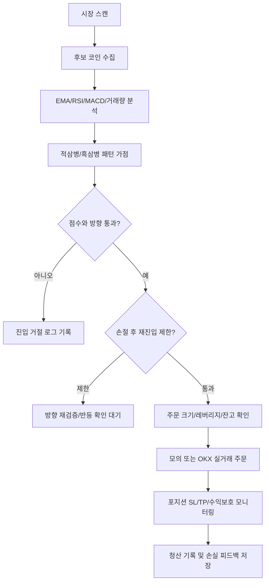

# OKX Auto Trader

OKX USDT 선물/스왑 자동매매 프로그램입니다. 실거래와 모의투자는 같은 후보 평가, 같은 진입 방향 판단, 같은 청산 규칙을 최대한 공유하도록 구성되어 있습니다. 단, 실거래에서는 OKX API의 주문 거절, 최소 주문 수량, 포지션 모드, 잔고 부족 같은 거래소 조건이 추가로 적용됩니다.

> 주의: 이 프로그램은 수익을 보장하지 않습니다. 자동매매는 손실 위험이 크며, 실거래 전 반드시 모의투자와 소액으로 검증해야 합니다.

## 전체 구조

| 영역 | 주요 파일 | 역할 |
|---|---|---|
| API 서버 | `backend/app/main.py` | FastAPI 엔드포인트, 설정 저장, 수동 주문, 백테스트 API |
| 자동매매 엔진 | `backend/app/engine/trader.py` | 스캔, 진입, 추가진입, 청산, 손절 후 재검증 |
| 후보 분석 | `backend/app/market/entry_analyzer.py` | EMA, RSI, MACD, 거래량, 캔들 패턴 점수화 |
| 캔들 패턴 | `backend/app/candle_patterns.py` | 적삼병/흑삼병 감지, 패턴 전용 SL/TP 계산 |
| 리스크 관리 | `backend/app/engine/risk_manager.py` | 최대 포지션, 일일 손실 제한, 점수/방향 필터 |
| 청산 규칙 | `backend/app/engine/exit_rules.py` | SL/TP, 트레일링, 수익보호 익절 |
| 동적 SL/TP | `backend/app/market/dynamic_sl_tp.py` | ATR, 지지/저항, 유동성 기반 SL/TP |
| 백테스트 | `backend/app/backtest/engine.py` | 실거래와 같은 진입/청산 규칙으로 과거 봉 시뮬레이션 |
| 프론트 | `frontend/src/main.tsx` | 대시보드, 설정, 포지션, 로그, 수동 선물 주문 |

## 자동매매 판단 흐름



## 진입 점수 규칙

기본 후보 점수는 다음 요소를 합산합니다.

| 요소 | 방향 | 반영 내용 |
|---|---|---|
| EMA 배열 | 롱/숏 | 정배열이면 롱 점수, 역배열이면 숏 방향 판단 강화 |
| RSI | 롱/숏 | 단타 적합 구간, 과열/과매도 구간을 점수에 반영 |
| MACD | 롱/숏 | 상승/하락 모멘텀 확인 |
| 저점/고점 구조 | 롱/숏 | 저점 상승, 하락 추세, 횡보 여부 판단 |
| 거래량 | 공통 | 평균 대비 거래량 증가 시 신뢰도 상승 |
| 24h 변동률 | 숏 보정 | 큰 하락과 약세 구간은 숏 후보로 보정 |
| 적삼병/흑삼병 | 롱/숏 | 5분, 10분, 1시간봉 패턴을 별도 가점으로 반영 |

## 적삼병/흑삼병 규칙

### 적삼병, 롱

| 조건 | 내용 |
|---|---|
| 캔들 | 최근 3개 봉이 모두 양봉 |
| 몸통 | 1봉 < 2봉 < 3봉 순서로 몸통 크기 증가 |
| 종가 | 1봉 종가 < 2봉 종가 < 3봉 종가 |
| 진입 | 3번째 캔들 종가 기준 롱 |
| 손절 | 1번째 캔들의 저가 |
| 익절 | 손익비 1:1, 즉 진입가와 손절가 거리만큼 위 |

### 흑삼병, 숏

| 조건 | 내용 |
|---|---|
| 캔들 | 최근 3개 봉이 모두 음봉 |
| 몸통 | 1봉 < 2봉 < 3봉 순서로 몸통 크기 증가 |
| 종가 | 1봉 종가 > 2봉 종가 > 3봉 종가 |
| 진입 | 3번째 캔들 종가 기준 숏 |
| 손절 | 1번째 캔들의 고가 |
| 익절 | 손익비 1:1, 즉 진입가와 손절가 거리만큼 아래 |

### 시간봉 가중치

| 봉 | 점수 보너스 | 의미 |
|---|---:|---|
| 5분봉 | +8 | 빠르지만 노이즈가 많음 |
| 10분봉 | +16 | 단타 기준 신뢰도 높음 |
| 1시간봉 | +24 | 방향성 신뢰도 가장 높게 반영 |

패턴 진입은 예외 규칙입니다. `백테스트 SL/TP 자동`이 켜져 있어도 적삼병/흑삼병으로 진입한 포지션은 ATR 또는 백테스트 추천 SL/TP가 아니라 패턴 자체의 `1봉 저가/고가 SL`과 `1:1 TP`를 우선 적용합니다.

## 손절 후 재검증 규칙

손절이 나면 같은 종목과 같은 방향으로 즉시 재진입하지 않습니다.

| 손실 원인 | 후속 처리 |
|---|---|
| 방향 오류 | 반대 방향 조건 또는 반대 패턴 확인 시 전환 진입 검토 |
| 타이밍 오류 | 전환 캔들, WaveTrend, EMA, MACD, 거래량 회복 확인 전까지 대기 |
| SL이 너무 좁음 | 같은 방향 재진입 가능하지만 진입 조건을 다시 확인 |
| 횡보장 진입 | 추세가 형성될 때까지 재진입 차단 |
| 반대 패턴 발생 | 같은 방향 재진입 차단 |

즉, 적삼병 롱이 손절난 뒤 흑삼병 또는 숏 전환 조건이 보이면 롱을 반복하지 않고 방향을 다시 확인합니다. 반대로 흑삼병 숏이 손절난 뒤 적삼병 또는 롱 전환 조건이 보이면 숏 반복 진입을 막습니다.

## 청산 규칙

| 청산 방식 | 설명 |
|---|---|
| 가격 SL/TP | 포지션별 손절가/익절가 도달 시 청산 |
| PnL(USDT) SL/TP | 사용자가 포지션별로 입력한 실제 USDT 손익 기준 청산 |
| 수익보호 익절 | TP 도달 전이라도 최고 수익 대비 되돌림이 크면 익절 |
| 추세 이탈 익절 | MACD 반전, EMA 이탈, 캔들 방향 전환이 확인되면 이익 상태에서 조기 청산 |
| 트레일링 스탑 | 일정 수익 이후 되돌림 발생 시 청산 |
| 수동 청산 | UI에서 포지션별 청산 |

포지션별로 `손절 사용 안 함`, `익절 사용 안 함`, `수익보호 사용 안 함`을 따로 체크할 수 있습니다.

## 백테스트 규칙

백테스트는 실거래와 같은 후보 분석과 청산 규칙을 최대한 사용합니다.

| 항목 | 방식 |
|---|---|
| 기본 봉 | 단타는 5분봉, 장타는 1시간봉 |
| 적삼병/흑삼병 | 5분봉 데이터는 10분/1시간으로 리샘플링해 상위봉 패턴도 평가 |
| SL/TP 최적화 | 일반 진입은 백테스트 추천 SL/TP를 사용할 수 있음 |
| 패턴 예외 | 적삼병/흑삼병 진입은 백테스트 추천 SL/TP 대신 패턴 SL/TP 적용 |
| 방향 비교 | 정방향/역방향, min_score, 구간별 성과 비교 |
| 자동 반영 | 표본 수, 승률, 손익, MDD, 구간 워크포워드 기준 통과 시만 설정 반영 |
| 누적 데이터 | `backend/data/backtest_history.jsonl`에 재시작 후에도 누적 |
| 손실 피드백 | 실거래 손절은 `backend/data/live_loss_feedback.jsonl`에 누적 |

## 실거래와 모의투자의 차이

| 항목 | 모의투자 | 실거래 |
|---|---|---|
| 후보 분석 | 동일 | 동일 |
| 방향 판단 | 동일 | 동일 |
| SL/TP 계산 | 동일 | 동일 계산 후 OKX 포지션에 반영 |
| 주문 체결 | 내부 포트폴리오 즉시 반영 | OKX API 체결/거절 결과 반영 |
| 최소 주문 | 내부 계산 | 거래소 최소 수량/계약 단위 적용 |
| 포지션 모드 | 내부 처리 | OKX posSide, margin mode 조건 필요 |

거래소가 API를 거절하는 경우를 제외하면 판단 로직은 같게 맞추는 것이 목표입니다.

## 운영 파일

| 파일 | 역할 |
|---|---|
| `run.bat` | 서버 실행 |
| `run-with-log.bat` | 로그 파일 남기며 서버 실행 |
| `restart-server.bat` | 서버 재시작 |
| `stop-server.bat` | 서버 중지 |
| `logs/oat-latest.log` | 최신 서버 로그 |
| `backend/data/settings.json` | 저장된 설정 |
| `backend/data/backtest_history.jsonl` | 백테스트 누적 기록 |
| `backend/data/live_loss_feedback.jsonl` | 실거래 손실 피드백 |
| `backend/data/symbol_sl_tp_profiles.json` | 종목별 SL/TP 프로필 |

## 개발/검증 명령

```powershell
backend\.venv\Scripts\python.exe -m compileall backend\app
cd frontend
npm.cmd run build
```

