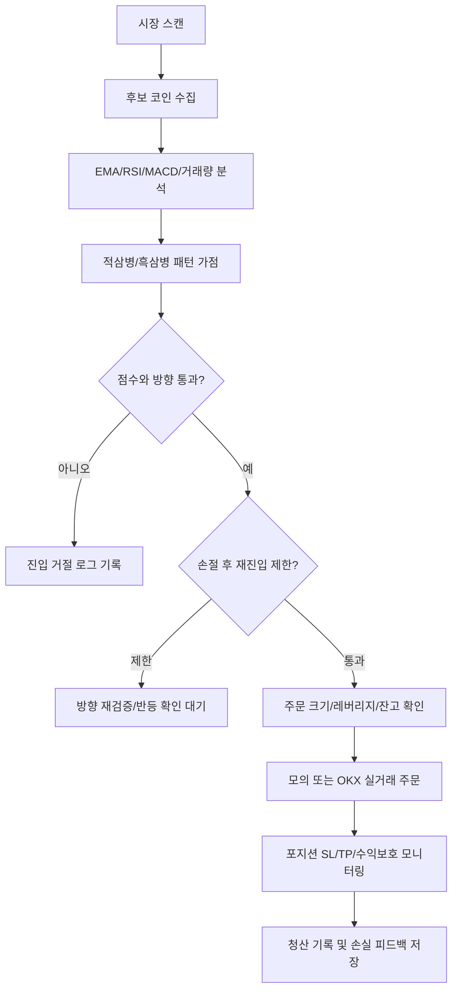

<<<<<<< ours
<<<<<<< ours
<<<<<<< ours
<<<<<<< ours
# OKX Auto Trader

OKX USDT 선물/스왑 자동매매 프로그램입니다. 실거래와 모의투자는 같은 후보 평가, 같은 진입 방향 판단, 같은 청산 규칙을 최대한 공유하도록 구성되어 있습니다. 단, 실거래에서는 OKX API의 주문 거절, 최소 주문 수량, 포지션 모드, 잔고 부족 같은 거래소 조건이 추가로 적용됩니다.

> 주의: 이 프로그램은 수익을 보장하지 않습니다. 자동매매는 손실 위험이 크며, 실거래 전 반드시 모의투자와 소액으로 검증해야 합니다.

## 전체 구조

| 영역 | 주요 파일 | 역할 |
|---|---|---|
| API 서버 | `backend/app/main.py` | FastAPI 엔드포인트, 설정 저장, 수동 주문, 백테스트 API |
| 자동매매 엔진 | `backend/app/engine/trader.py` | 스캔, 진입, 추가진입, 청산, 손절 후 재검증 |
| 후보 분석 | `backend/app/market/entry_analyzer.py` | EMA, RSI, MACD, 거래량, 캔들 패턴 점수화 |
| 캔들 패턴 | `backend/app/candle_patterns.py` | 적삼병/흑삼병 감지, 패턴 전용 SL/TP 계산 |
| 리스크 관리 | `backend/app/engine/risk_manager.py` | 최대 포지션, 일일 손실 제한, 점수/방향 필터 |
| 청산 규칙 | `backend/app/engine/exit_rules.py` | SL/TP, 트레일링, 수익보호 익절 |
| 동적 SL/TP | `backend/app/market/dynamic_sl_tp.py` | ATR, 지지/저항, 유동성 기반 SL/TP |
| 백테스트 | `backend/app/backtest/engine.py` | 실거래와 같은 진입/청산 규칙으로 과거 봉 시뮬레이션 |
| 프론트 | `frontend/src/main.tsx` | 대시보드, 설정, 포지션, 로그, 수동 선물 주문 |

## 자동매매 판단 흐름



## 진입 점수 규칙

기본 후보 점수는 다음 요소를 합산합니다.

| 요소 | 방향 | 반영 내용 |
|---|---|---|
| EMA 배열 | 롱/숏 | 정배열이면 롱 점수, 역배열이면 숏 방향 판단 강화 |
| RSI | 롱/숏 | 단타 적합 구간, 과열/과매도 구간을 점수에 반영 |
| MACD | 롱/숏 | 상승/하락 모멘텀 확인 |
| 저점/고점 구조 | 롱/숏 | 저점 상승, 하락 추세, 횡보 여부 판단 |
| 거래량 | 공통 | 평균 대비 거래량 증가 시 신뢰도 상승 |
| 24h 변동률 | 숏 보정 | 큰 하락과 약세 구간은 숏 후보로 보정 |
| 적삼병/흑삼병 | 롱/숏 | 5분, 10분, 1시간봉 패턴을 별도 가점으로 반영 |

## 적삼병/흑삼병 규칙

### 적삼병, 롱

| 조건 | 내용 |
|---|---|
| 캔들 | 최근 3개 봉이 모두 양봉 |
| 몸통 | 1봉 < 2봉 < 3봉 순서로 몸통 크기 증가 |
| 종가 | 1봉 종가 < 2봉 종가 < 3봉 종가 |
| 진입 | 3번째 캔들 종가 기준 롱 |
| 손절 | 1번째 캔들의 저가 |
| 익절 | 손익비 1:1, 즉 진입가와 손절가 거리만큼 위 |

### 흑삼병, 숏

| 조건 | 내용 |
|---|---|
| 캔들 | 최근 3개 봉이 모두 음봉 |
| 몸통 | 1봉 < 2봉 < 3봉 순서로 몸통 크기 증가 |
| 종가 | 1봉 종가 > 2봉 종가 > 3봉 종가 |
| 진입 | 3번째 캔들 종가 기준 숏 |
| 손절 | 1번째 캔들의 고가 |
| 익절 | 손익비 1:1, 즉 진입가와 손절가 거리만큼 아래 |

### 시간봉 가중치

| 봉 | 점수 보너스 | 의미 |
|---|---:|---|
| 5분봉 | +8 | 빠르지만 노이즈가 많음 |
| 10분봉 | +16 | 단타 기준 신뢰도 높음 |
| 1시간봉 | +24 | 방향성 신뢰도 가장 높게 반영 |

패턴 진입은 예외 규칙입니다. `백테스트 SL/TP 자동`이 켜져 있어도 적삼병/흑삼병으로 진입한 포지션은 ATR 또는 백테스트 추천 SL/TP가 아니라 패턴 자체의 `1봉 저가/고가 SL`과 `1:1 TP`를 우선 적용합니다.

## 손절 후 재검증 규칙

손절이 나면 같은 종목과 같은 방향으로 즉시 재진입하지 않습니다.

| 손실 원인 | 후속 처리 |
|---|---|
| 방향 오류 | 반대 방향 조건 또는 반대 패턴 확인 시 전환 진입 검토 |
| 타이밍 오류 | 전환 캔들, WaveTrend, EMA, MACD, 거래량 회복 확인 전까지 대기 |
| SL이 너무 좁음 | 같은 방향 재진입 가능하지만 진입 조건을 다시 확인 |
| 횡보장 진입 | 추세가 형성될 때까지 재진입 차단 |
| 반대 패턴 발생 | 같은 방향 재진입 차단 |

즉, 적삼병 롱이 손절난 뒤 흑삼병 또는 숏 전환 조건이 보이면 롱을 반복하지 않고 방향을 다시 확인합니다. 반대로 흑삼병 숏이 손절난 뒤 적삼병 또는 롱 전환 조건이 보이면 숏 반복 진입을 막습니다.

## 청산 규칙

| 청산 방식 | 설명 |
|---|---|
| 가격 SL/TP | 포지션별 손절가/익절가 도달 시 청산 |
| PnL(USDT) SL/TP | 사용자가 포지션별로 입력한 실제 USDT 손익 기준 청산 |
| 수익보호 익절 | TP 도달 전이라도 최고 수익 대비 되돌림이 크면 익절 |
| 추세 이탈 익절 | MACD 반전, EMA 이탈, 캔들 방향 전환이 확인되면 이익 상태에서 조기 청산 |
| 트레일링 스탑 | 일정 수익 이후 되돌림 발생 시 청산 |
| 수동 청산 | UI에서 포지션별 청산 |

포지션별로 `손절 사용 안 함`, `익절 사용 안 함`, `수익보호 사용 안 함`을 따로 체크할 수 있습니다.

## 백테스트 규칙

백테스트는 실거래와 같은 후보 분석과 청산 규칙을 최대한 사용합니다.

| 항목 | 방식 |
|---|---|
| 기본 봉 | 단타는 5분봉, 장타는 1시간봉 |
| 적삼병/흑삼병 | 5분봉 데이터는 10분/1시간으로 리샘플링해 상위봉 패턴도 평가 |
| SL/TP 최적화 | 일반 진입은 백테스트 추천 SL/TP를 사용할 수 있음 |
| 패턴 예외 | 적삼병/흑삼병 진입은 백테스트 추천 SL/TP 대신 패턴 SL/TP 적용 |
| 방향 비교 | 정방향/역방향, min_score, 구간별 성과 비교 |
| 자동 반영 | 표본 수, 승률, 손익, MDD, 구간 워크포워드 기준 통과 시만 설정 반영 |
| 누적 데이터 | `backend/data/backtest_history.jsonl`에 재시작 후에도 누적 |
| 손실 피드백 | 실거래 손절은 `backend/data/live_loss_feedback.jsonl`에 누적 |

## 실거래와 모의투자의 차이

| 항목 | 모의투자 | 실거래 |
|---|---|---|
| 후보 분석 | 동일 | 동일 |
| 방향 판단 | 동일 | 동일 |
| SL/TP 계산 | 동일 | 동일 계산 후 OKX 포지션에 반영 |
| 주문 체결 | 내부 포트폴리오 즉시 반영 | OKX API 체결/거절 결과 반영 |
| 최소 주문 | 내부 계산 | 거래소 최소 수량/계약 단위 적용 |
| 포지션 모드 | 내부 처리 | OKX posSide, margin mode 조건 필요 |

거래소가 API를 거절하는 경우를 제외하면 판단 로직은 같게 맞추는 것이 목표입니다.

## 운영 파일

| 파일 | 역할 |
|---|---|
| `run.bat` | 서버 실행 |
| `run-with-log.bat` | 로그 파일 남기며 서버 실행 |
| `restart-server.bat` | 서버 재시작 |
| `stop-server.bat` | 서버 중지 |
| `logs/oat-latest.log` | 최신 서버 로그 |
| `backend/data/settings.json` | 저장된 설정 |
| `backend/data/backtest_history.jsonl` | 백테스트 누적 기록 |
| `backend/data/live_loss_feedback.jsonl` | 실거래 손실 피드백 |
| `backend/data/symbol_sl_tp_profiles.json` | 종목별 SL/TP 프로필 |

## 개발/검증 명령

```powershell
backend\.venv\Scripts\python.exe -m compileall backend\app
cd frontend
npm.cmd run build
```

=======
# Ollama Agent Server

Ollama Agent Server는 Ollama가 설치된 Linux 서버에서 실행되는 원격 코딩/디버깅 에이전트 API입니다. 다른 PC는 HTTP API로 작업을 요청하고, 이 서버는 실제 Ollama 호스트 내부에서 명령 실행, 파일 확인, 테스트, 디버깅을 수행한 뒤 최종 답변과 실행 로그를 JSON으로 반환합니다.

## 목표

- Claude Code, Codex처럼 “질문 → 서버 내부 작업 수행 → 결과 반환” 흐름을 Ollama 기반으로 제공합니다.
- Ollama 모델은 JSON 액션을 생성하고, 서버는 해당 액션에 따라 Linux shell 명령을 실행합니다.
- 각 명령의 `stdout`, `stderr`, 종료 코드, 타임아웃 여부를 API 응답에 포함합니다.
=======
=======
>>>>>>> theirs
=======
>>>>>>> theirs
# Ollama Agent Server

Ollama Agent Server는 Ollama가 설치된 Linux 서버에서 실행되는 원격 코딩/디버깅 에이전트 API + 웹 콘솔입니다. 다른 PC는 브라우저 또는 HTTP API로 작업을 요청하고, 이 서버는 실제 Ollama 호스트 내부에서 명령 실행, 파일 확인, 테스트, 디버깅을 수행한 뒤 최종 답변과 실행 로그를 반환합니다.

> 현재 버전은 “최종 완성품”이 아니라 **Codex/Claude Code류 제품으로 확장하기 위한 실행 가능한 MVP**입니다. 이번 버전에는 API, 백그라운드 작업, Codex 스타일 웹 UI, 실행 로그 타임라인이 포함됩니다. 멀티 유저 계정/결제/컨테이너 격리/장기 작업 영속화 같은 클라우드 서비스 기능은 다음 단계에서 붙이는 구조입니다.

## 포함된 기능

- Claude Code, Codex처럼 “질문 → 서버 내부 작업 수행 → 결과 반환” 흐름을 Ollama 기반으로 제공합니다.
- Ollama 모델은 JSON 액션을 생성하고, 서버는 해당 액션에 따라 Linux shell 명령을 실행합니다.
- 각 명령의 `stdout`, `stderr`, 종료 코드, 타임아웃 여부를 API 응답과 UI 타임라인에 표시합니다.
- `/v1/run` 동기 API와 `/v1/jobs` + `/v1/jobs/{job_id}` 비동기 작업 API를 모두 제공합니다.
- `/` 또는 `/app`에서 Codex 화면과 비슷한 어두운 콘솔 UI를 제공합니다.
- API 키 인증 옵션으로 원격 PC 접근을 제한할 수 있습니다.
<<<<<<< ours
<<<<<<< ours
>>>>>>> theirs
=======
>>>>>>> theirs
=======
>>>>>>> theirs

## 설치

```bash
python -m venv .venv
source .venv/bin/activate
pip install -e .
```

Ollama 서버가 같은 머신에서 실행 중인지 확인하세요.

```bash
ollama serve
ollama pull llama3.1
<<<<<<< ours
<<<<<<< ours
<<<<<<< ours
```

## 실행
=======
=======
>>>>>>> theirs
=======
>>>>>>> theirs
# 코딩 작업이면 아래 같은 코드 모델도 권장합니다.
ollama pull qwen2.5-coder
```

## 실행법

### 1) 기본 실행
<<<<<<< ours
<<<<<<< ours
>>>>>>> theirs
=======
>>>>>>> theirs
=======
>>>>>>> theirs

```bash
export OLLAMA_AGENT_DEFAULT_MODEL=llama3.1
export OLLAMA_AGENT_WORKSPACE_ROOT=/srv/agent-workspaces
ollama-agent-server
```

기본 서버 주소는 `0.0.0.0:8080`이고 기본 Ollama 주소는 `http://127.0.0.1:11434`입니다.

<<<<<<< ours
<<<<<<< ours
<<<<<<< ours
## 보안 옵션

원격 PC에서 호출할 예정이면 API 키 사용을 권장합니다.
=======
=======
>>>>>>> theirs
=======
>>>>>>> theirs
### 2) 다른 PC에서 웹 UI 접속

브라우저에서 아래 주소로 접속합니다.

```text
http://SERVER_IP:8080/
```

화면 왼쪽에서 모델, 워크스페이스, 최대 단계, API 키를 설정하고 아래 입력창에 작업을 넣으면 됩니다.

예시 프롬프트:

```text
이 프로젝트 구조를 확인하고 테스트를 실행한 뒤 실패 원인을 고쳐줘. 마지막에는 변경 파일과 실행한 테스트를 정리해줘.
```

### 3) 원격 접속용 API 키 켜기

공개망 또는 같은 사무실 네트워크에서 사용할 때는 API 키를 켜세요.
<<<<<<< ours
<<<<<<< ours
>>>>>>> theirs
=======
>>>>>>> theirs
=======
>>>>>>> theirs

```bash
export OLLAMA_AGENT_REQUIRE_API_KEY=true
export OLLAMA_AGENT_API_KEY='change-me'
<<<<<<< ours
<<<<<<< ours
<<<<<<< ours
```

요청 시 `X-API-Key` 헤더를 포함합니다.
=======
=======
>>>>>>> theirs
=======
>>>>>>> theirs
ollama-agent-server
```

웹 UI의 왼쪽 `서버 API Key` 입력칸에 같은 값을 입력합니다. API 호출 시에는 `X-API-Key` 헤더를 포함합니다.
<<<<<<< ours
<<<<<<< ours
>>>>>>> theirs
=======
>>>>>>> theirs
=======
>>>>>>> theirs

## API 예시

### 상태 확인

```bash
curl http://SERVER_IP:8080/health
```

### 모델 목록

```bash
curl -H 'X-API-Key: change-me' http://SERVER_IP:8080/v1/models
```

<<<<<<< ours
<<<<<<< ours
<<<<<<< ours
### 작업 실행
=======
### 동기 작업 실행

작업이 끝날 때까지 HTTP 요청이 유지됩니다.
>>>>>>> theirs
=======
### 동기 작업 실행

작업이 끝날 때까지 HTTP 요청이 유지됩니다.
>>>>>>> theirs
=======
### 동기 작업 실행

작업이 끝날 때까지 HTTP 요청이 유지됩니다.
>>>>>>> theirs

```bash
curl -X POST http://SERVER_IP:8080/v1/run \
  -H 'Content-Type: application/json' \
  -H 'X-API-Key: change-me' \
  -d '{
    "model": "llama3.1",
    "workspace": "demo-project",
    "prompt": "현재 디렉터리 파일을 확인하고 README가 없으면 간단히 만들어줘.",
    "max_steps": 8
  }'
```

<<<<<<< ours
<<<<<<< ours
<<<<<<< ours
응답은 최종 답변과 각 단계의 명령 실행 결과를 포함합니다.
=======
=======
>>>>>>> theirs
=======
>>>>>>> theirs
### 비동기 작업 실행

UI는 이 방식을 사용합니다. 먼저 작업을 만들고:

```bash
curl -X POST http://SERVER_IP:8080/v1/jobs \
  -H 'Content-Type: application/json' \
  -H 'X-API-Key: change-me' \
  -d '{
    "model": "qwen2.5-coder",
    "workspace": "demo-project",
    "prompt": "테스트를 실행하고 실패를 고쳐줘.",
    "max_steps": 12
  }'
```

반환된 `job_id`로 진행 상황을 조회합니다.

```bash
curl -H 'X-API-Key: change-me' http://SERVER_IP:8080/v1/jobs/JOB_ID
```
<<<<<<< ours
<<<<<<< ours
>>>>>>> theirs
=======
>>>>>>> theirs
=======
>>>>>>> theirs

## 환경 변수

모든 환경 변수는 `OLLAMA_AGENT_` 접두사를 사용합니다.

| 변수 | 기본값 | 설명 |
| --- | --- | --- |
| `OLLAMA_BASE_URL` | `http://127.0.0.1:11434` | Ollama API 주소 |
| `DEFAULT_MODEL` | `llama3.1` | 기본 모델 |
| `HOST` | `0.0.0.0` | API 서버 bind host |
| `PORT` | `8080` | API 서버 port |
| `WORKSPACE_ROOT` | 현재 디렉터리 | 작업 디렉터리 루트 |
| `COMMAND_TIMEOUT_SECONDS` | `60` | 명령당 타임아웃 |
| `MAX_STEPS` | `12` | 에이전트 최대 반복 횟수 |
| `MAX_COMMAND_OUTPUT_CHARS` | `12000` | 명령 출력 최대 보존 길이 |
| `REQUIRE_API_KEY` | `false` | API 키 인증 사용 여부 |
| `API_KEY` | 없음 | API 키 |

예를 들어 `DEFAULT_MODEL`은 실제 환경 변수 이름으로 `OLLAMA_AGENT_DEFAULT_MODEL`입니다.

<<<<<<< ours
<<<<<<< ours
<<<<<<< ours
## 현재 한계

- 초기 버전은 동기식 `/v1/run` 엔드포인트만 제공합니다.
- Ollama 모델이 지시한 shell 명령을 실제로 실행하므로 격리된 VM, 컨테이너, 별도 계정에서 운영하는 것을 권장합니다.
- 장기 실행 작업 큐, 브라우저 조작, 멀티 세션 관리는 후속 단계에서 확장할 수 있습니다.
>>>>>>> theirs
=======
=======
>>>>>>> theirs
=======
>>>>>>> theirs
## 클라우드 서비스로 확장할 다음 단계

에이전트 기반 코딩 AI와 클라우드 서비스로 완성하려면 아래 기능을 추가하는 것이 좋습니다.

1. **작업 격리**: 사용자/프로젝트별 Docker 컨테이너 또는 VM에서 명령 실행.
2. **영속 작업 큐**: 현재 in-memory job store를 Redis/RQ, Celery, Postgres 기반 큐로 교체.
3. **계정/권한**: 사용자 로그인, 프로젝트 권한, API 토큰 관리.
4. **파일 탐색/편집 UI**: 웹에서 파일 트리, diff, 패치 승인 기능 제공.
5. **실시간 스트리밍**: polling 대신 WebSocket/SSE로 토큰과 명령 로그를 즉시 전달.
6. **감사 로그/비용 관리**: 실행 명령, 모델 호출, 사용량, 실패 로그 저장.
7. **배포 구성**: Nginx TLS reverse proxy, systemd service, 컨테이너 이미지, 백업 정책.

## 보안 주의

Ollama 모델이 지시한 shell 명령을 실제로 실행합니다. 운영 환경에서는 반드시 격리된 VM/컨테이너/별도 Linux 계정에서 실행하고, 워크스페이스 루트를 제한하며, API 키와 방화벽을 사용하세요.
<<<<<<< ours
<<<<<<< ours
>>>>>>> theirs
=======
>>>>>>> theirs
=======
>>>>>>> theirs
